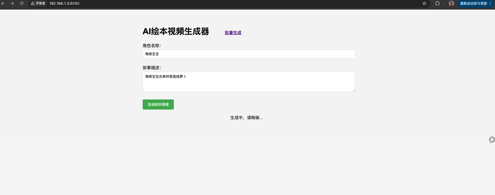
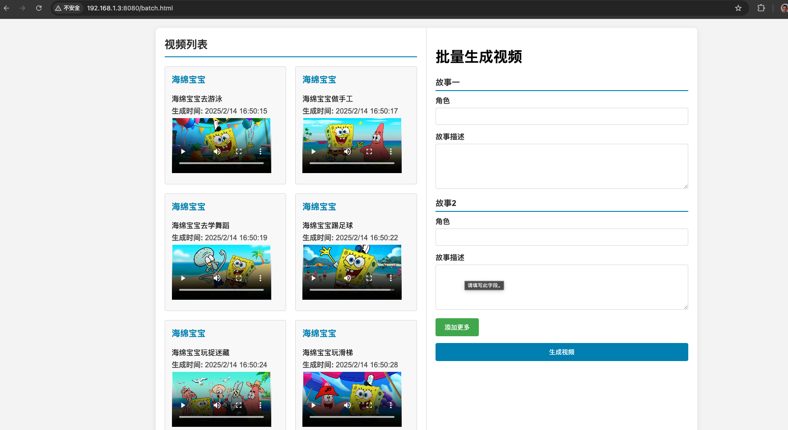

启动项目：BookApplication
打开浏览器并访问：
- 单独生成绘本: [http://localhost:8080](http://localhost:8080)
- 批量生成绘本: [http://localhost:8080/batch.html](http://localhost:8080/batch.html)

## 使用说明

1. **单独生成绘本**：在首页输入角色名称和故事描述，然后点击“生成”按钮。生成的绘本将显示在页面上，并保存到历史记录中。
2. **批量生成绘本**：在批量生成页面，按照格式要求输入多组角色和故事描述，然后点击“批量生成”按钮。完成后，所有生成的绘本都会被添加到历史记录中。
## 应用截图
   <div >
    
     
</div>

## 赞助开发者
您的支持将帮助我持续维护项目并开发新功能。无论是小额捐赠还是分享项目，都是对我的巨大支持。
# 立即支持
   <div >
    
    
   </div>

## 注意事项
- 项目中使用了三个大模型：
  
  1 `qwen-turbo`：用于生成故事描述 代码在这里TongYiTextGenerate。
  
  2 `wanx2.1-t2i-plus`：用于生成绘本每一帧图片 代码在这里TongYiImageGenerate。
  
  3 `cosyvoice-v1`：用于生成绘本配音 代码在这里TongYiVoiceGenerate。
  
- 这些大模型都是使用的百炼平台中的模型，需要百炼的API KEY ,所以要确保环境变量 `DASHSCOPE_API_KEY` 已正确配置，否则API请求将会失败。
- 系统还需要ffmpeg转码音频为mp3格式，所以需要确保系统已经安装ffmpeg ，需要安装ffmpeg 7.1 https://www.ffmpeg.org/download.html。
- 视频应该放置nginx的根目录，具体配置是app.properties中的videoDir，即nginx的根目录
- 视频需要通过nginx映射，具体配置：
```
    server {
        listen       80;
        server_name  localhost;

        location / {      
        add_header 'Access-Control-Allow-Origin' '*';
        add_header 'Access-Control-Allow-Headers' '*';
        add_header 'Access-Control-Allow-Methods' '*'; 
        if ($request_method = 'OPTIONS') {
            return 204;
        }
        root   /opt/homebrew/var/www;
        index  index.html index.htm;
        }     
        error_page   500 502 503 504  /50x.html;
        location = /50x.html {
            root   html;
        }
   
    }
```

## 联系方式

如果有任何问题或建议，请联系项目维护者 zhusiyuanhao@163.com。
